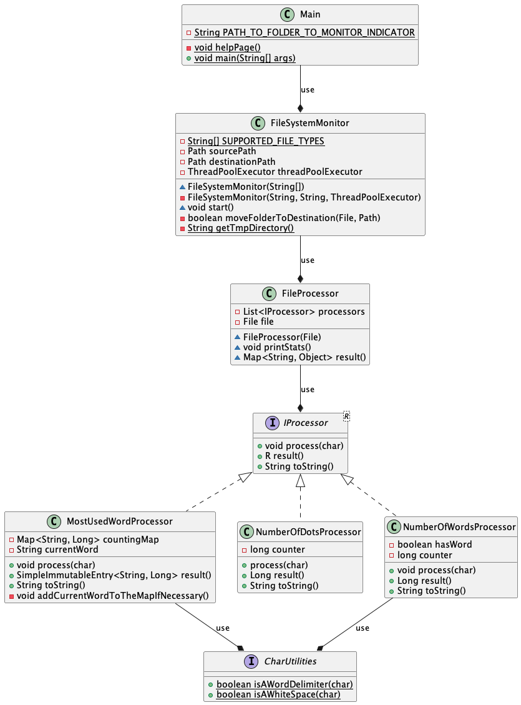

# Continuous File Processor

## Motivation

This project is created by Idil Saglam for the HICX's interview process. All rights are reserved to the project's author

## Structure of code

Here's an overall class diagram for the implementation \


| Class name            | Description                                                                                                                                                                                                |
|-----------------------|------------------------------------------------------------------------------------------------------------------------------------------------------------------------------------------------------------|
| Main                  | The class which a user interacts with. Seperated from other classes because in this way we can extend the application if necessary by adding other interaction points such as REST API, GUI etc.           |
| FileSystemMonitor     | The class responsible from monitoring the file system with given source path.                                                                                                                              | 
| FileProcessor         | The class responsible from processing of a single file                                                                                                                                                     |                                                                                                                                          |
| IProcessor            | The interface defines what should be implemented in a processor. It's used in the file processor as a list of processors                                                                                   |
| MostUsedWordProcessor | The class which implements IProcessor and which is responsible to determinate the most used word in the file. It counts the number of occurrence of each word in a HashMap and then calculates the maximum |
| NumberOfDotsProcessor | The class which implements IProcessor and which is responsible of counting dot characters in the file                                                                                                      |
 | NumberOfWordProcessor | The class implements IProcessor interface and is responsible of counting the number of words in the file                                                                                                   |
| CharUtilities         | An interface which contains utility functions on char. It could be also an abstract class but as there's no attribute related logic or any private fields interface is enough                              |

## Build

From project's root directory. Run the following command tp create an executable JAR archive
```bash
mvn clean pakcage
```

The executable jar will be created under `target` folder.

## Usage

You can either use the executable `JAR` file created in [build section](#build), or you can use the following command to build and run directly

```bash
mvn clean compile exec:java -Dexec.arguments="<source_folder_to_monitor>,[<destination_folder_path>]"
```

If you prefer to use the executable `JAR`, you can use the following command

```bash
java -jar target/hicx-test-1.0-SNAPSHOT.jar <source_folder_to_monitor> [<destination_folder_path>]
```

**IMPORTANT:** On the above notation, arguments surrounded by brackets (`[` and `]`) represents an optional argument. If this argument is missing processed files will be copied to a temporary folder.

## Test

To run all tests

```bash
mvn test
```
